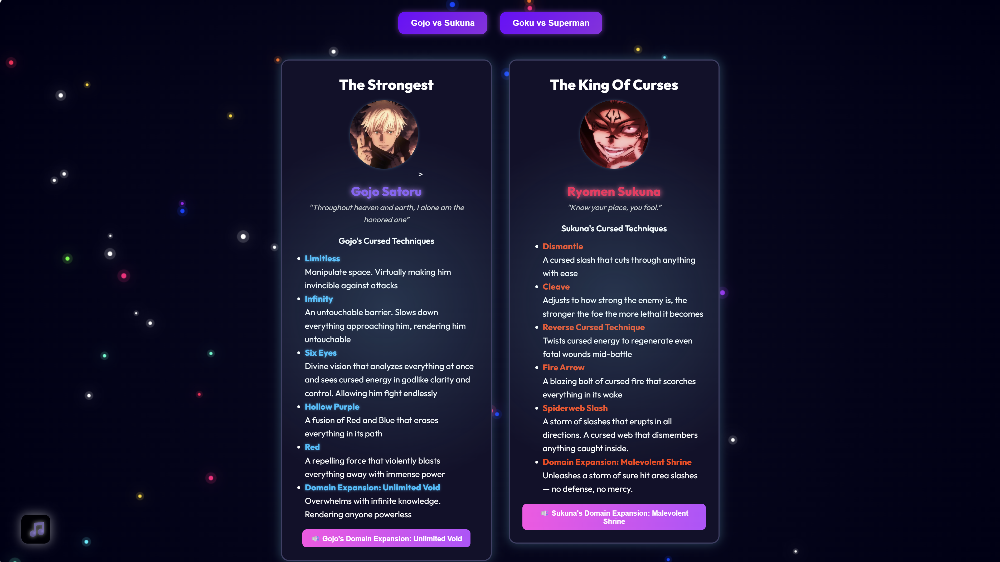

<h1 align="center">Anime Arena</h1>

<a href="#project-description">Project Description</a> - <a href="#key-features">Key Features</a> - <a href="#technology-stack">Tech Stack</a>

## Project Description

Live link: https://lmfsabaricos.github.io/Anime-Page/

A fun and very engaging project primarily built using HTML, CSS, and JavaScript.

The Anime Arena Project was created as a way to practice and sharpen my frontend skills with a fully interactive and creative design in mind. It showcases advanced DOM manipulation, dynamic JavaScript features, and a strong focus on user experience.

The site includes a custom loader, animated particle background, and smooth fade-in effects to elevate the presentation. Core features like the live voting chart, battle simulation with health bars, music player, and debate comment section to make it feel like a complete and immersive anime showdown. There's also a responsive quiz section and toggleable matchups — all built to be mobile-friendly and visually rich.

More features coming soon, including backend integration and a plan of making it to a fully fledge full stack anime page!

## Key Features

**⚔️ Battle System**: Interactive health bars and custom attacks for each matchups

**🗳️ Live Poll Chart**: Dynamic vote tracker with live poll chart from Chart.js

**💬 Debate Comments**: Comment system with an option to upload a profile picture and an option to change it anytime

**🎧 Music Player**: Toggleable themed music with playlist, volume, and progress control

**🎇 Spiral Loader**: Canvas-based animated spiral loader with pulse effect

**🌀 Background Particles**: Canvas moving particle background for visual effect

**📦 Persistent Storage**: Uses `localStorage` to keep votes and comment name saved even after refreshing the page

**✨ Scroll Animations**: Fade-in content triggered by Intersection Observer

**📱 Responsive Design**: Optimized layout for desktop and mobile devices

## Tech Stack

**Frontend**: HTML, CSS, JavaScript
**Libraries**: Chart.js, Font Awesome, Custom Canvas
**Web APIs**: DOM Manipulation, Local Storage, Intersection Observer
**Tools**: VS Code, Git, GitHub
